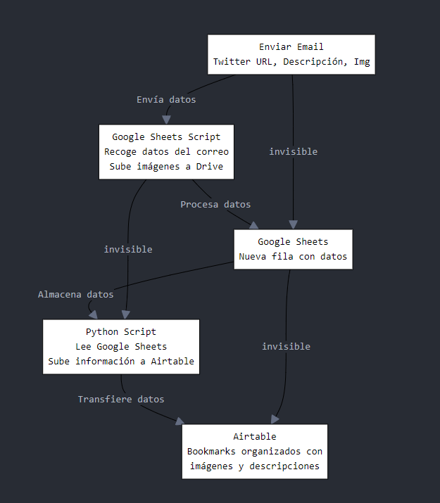

# 📑 Twitter Bookmark Automation 
Por: Mario Valle Reyes ([@bilbeny](https://www.x.com/bilbeny/))

## 📘 *Introducción* 

Este proyecto es un pequeño experimento que explora de manera sencilla la interacción entre **Twitter** (ahora X pero aquí le seguiremos llamando Twitter), **Gmail**, **Google Sheets** y **Airtable** para administrar y guardar bookmarks.

### *Descripción*
Automatiza los bookmarks de tweets con **Airtable**, **Google Sheets** y **Python** para rastrear, categorizar y almacenar contenido de Twitter junto con los archivos adjuntos. Obtén ideas organizadas y accesibles de tus bookmarks con el mínimo esfuerzo, todo sin necesidad de pagar el acceso a la API de X ni una membresía para organizar marcadores en carpetas.

### *Utilidad*
Este proyecto es ideal para quienes desean organizar sus bookmarks de Twitter de manera automática y sin la necesidad de pagar por la API de X o por suscripciones premium. Con esta solución, puedes guardar contenido relevante, incluyendo imágenes, en **Airtable** de manera organizada, accesible y con un mínimo esfuerzo a través de **Gmail**.

### *Personalización*
El flujo de trabajo presentado en este repositorio es totalmente personalizable, permitiendo que el usuario ajuste las reglas de procesamiento, categorías de los tuits/bookmarks y cómo se almacenan las imágenes adjuntas (en caso de que haya) según las necesidades.

---


---
  
## 📋 *Requisitos Previos* 

### 🛠️ *Herramientas necesarias* 
-**Python 3.x**: Es necesario tener instalada una versión reciente de [Python](https://www.python.org/downloads/).   
-**Google Sheets y Gmail**: El proyecto requiere cuentas activas de Google con acceso a [Gmail](https://mail.google.com/) y [Google Sheets](https://www.google.com/sheets/about/).  
-**Airtable**: Una cuenta de [Airtable](https://airtable.com/) para crear la base donde se almacenarán los bookmarks.  
-**Google Cloud Console**: Es necesario configurar las credenciales de Google para que el script acceda a Google Sheets y Google Drive.  

### 🌐 *Cuentas y servicios a configurar* 
1.**Google Cloud Console**:
   - Habilitar las APIs de Google Sheets y Google Drive en un proyecto de [Google Cloud](https://console.cloud.google.com/).
   - Generar y descargar el archivo `credentials.json` para que el script pueda acceder a los servicios de Google.

2.**Airtable**:
   - Crear una nueva base en Airtable con una tabla configurada según los encabezados del archivo CSV proporcionado en este repositorio.
   - Generar una API Key en [Airtable](https://airtable.com/account) para que el script pueda autenticar sus solicitudes.

### 📦 *Bibliotecas y dependencias necesarias*  
1.**Instalación de dependencias**:
   - Ejecutar el siguiente comando para instalar las dependencias desde el archivo `requirements.txt`:
     ```bash
     pip install -r requirements.txt
     ```
   - Las principales bibliotecas incluidas son:
     - `requests`: Para realizar solicitudes HTTP a la API de Airtable.
     - `gspread`: Para interactuar con Google Sheets.
     - `oauth2client`: Para gestionar las credenciales de Google.
    
---

## ⚙️ *Configuración Inicial* 

### 🗂️ *Clonar el Repositorio* 
Primero es necesario clonar este repositorio en el entorno loocal del usuario:
```bash
git clone https://github.com/mariovallereyes/small_bkmrk_autoapp.git  
cd small_bkmrk_autoapp
```

### 🔑 *Configurar y obtener credenciales* 
1. **API Key de Airtable:**
    - Generar una API Key en el website de [Airtable](https://airtable.com/)
    - Insertar la API Key en el archivo `config.json`.
2. **Credenciales JSON de Google Cloud:**
    - Crear un proyecto nuevo en la consola de [Google Cloud](https://console.cloud.google.com/).  
    - Habilitar las APIs necesarias para [Google Sheets](https://www.google.com/sheets/about/) y [Google Drive](https://drive.google.com/).
    - Generar un archivo de credenciales JSON para la cuenta de servicio.
    - Descargar y colocar ese archivo en el directorio del proyecto, actualizando el archivo `config.json` con la ruta correcta.

### 🛠️ **Preparar los Entornos:** 
-**Python**:
   - La última versión de Python es necesaria. Instalar dependencias con:
     ```bash
     pip install -r requirements.txt 
     ```
-**Google Sheets**:
   - Crear una hoja de Google Sheets con la estructura descrita en el archivo `google-sheets-structure.csv` en este repositorio.

-**Airtable**:
   - Crear una base nueva (cuenta gratis es suficiente) y configurar una tabla siguiendo los encabezados en el archivo `Main Table - Airtable Bookmarks.csv`.  
     


